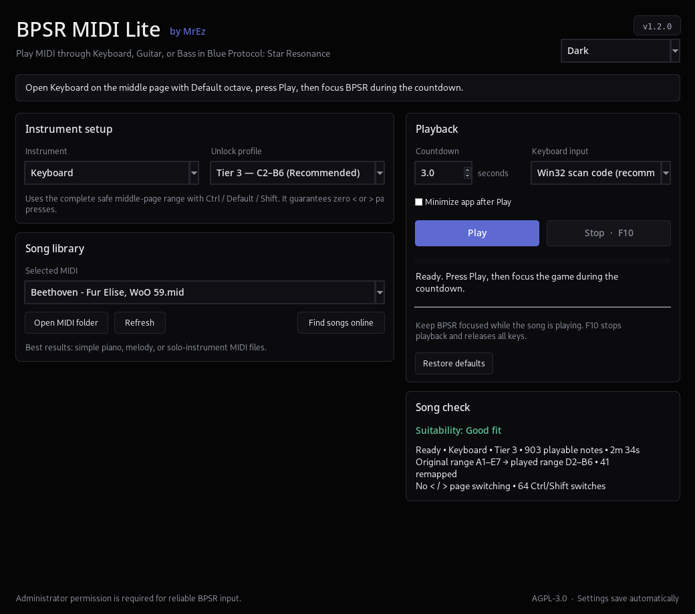

# 🎹 BPSR MIDI Lite

  A lightweight MIDI instrument player for <strong>Blue Protocol: Star Resonance</strong>. 
  Supports <strong>Keyboard, Guitar, and Bass</strong>. 
  Created by <strong>MrEz</strong>.

  
  
  

> [!IMPORTANT]
> Requires **Windows 10 or Windows 11, 64-bit**.
> Accept the Administrator prompt when opening the application.
> Administrator permission is required for reliable BPSR input.

## About

BPSR MIDI Lite reads `.mid` and `.midi` files and converts their notes into keyboard input for BPSR's in-game instruments.

The project is designed specifically for MIDI-based music playback. It does **not** automate combat, fishing, gathering, dungeons, or other gameplay systems.

Compiled Windows binaries are distributed separately as GitHub Release assets.

## Highlights

* Keyboard, Guitar, and Bass support
* Simple unlock-based instrument profiles
* Fixed profiles that avoid the `<` and `>` page keys
* Automatic **Good fit / Busy / Very complex** song analysis
* Automatic note folding and remapping
* Guarded page switching for experimental full-range playback
* Reduced timing stalls during dense songs
* Rounded modern interface
* Seven selectable colour themes
* `F10` emergency stop
* Standalone Windows application

## Quick Start

1. Obtain the Windows application from the project's GitHub Release assets.
2. Open the application.
3. Accept the Administrator prompt.
4. Choose **Keyboard**, **Guitar**, or **Bass**.
5. Choose the profile matching your in-game unlock.
6. Click **Open MIDI folder** and add your `.mid` or `.midi` files.
7. Click **Refresh**, then select a song.
8. Open the matching BPSR instrument:

   * Keyboard/Guitar: middle page + Default octave
   * Bass: Default mode
9. Click **Play** and focus BPSR before the countdown ends.
10. Press `F10` to stop at any time.

## Instrument Profiles

| Instrument   | Tier 1 | Tier 2    | Tier 3                  | Custom                           |
| ------------ | ------ | --------- | ----------------------- | -------------------------------- |
| **Keyboard** | C3–B4  | C3–B6     | **C2–B6 — recommended** | Configurable; experimental A0–C8 |
| **Guitar**   | C3–B4  | E2–B4     | **E2–D6**               | Configurable experimental range  |
| **Bass**     | E1–B2  | **E1–B3** | —                       | Manual E1–B2 or E1–B3            |

Fixed profiles are recommended because they use safe ranges and avoid page switching. Custom profiles are available for advanced tuning.

## Colour Themes

Use the dropdown below the version number to choose:

* Light
* Dark
* Dracula
* Nord
* Catppuccin Mocha
* Solarized Dark
* Tokyo Night

The selected theme is saved automatically.

## Choosing MIDI Files

Simple piano, melody, acoustic, and solo-instrument arrangements usually work best.

Very dense orchestral, full-band, drum-heavy, impossible-piano, and Black MIDI files may sound crowded because BPSR has fewer playable notes than a full MIDI arrangement.

## Notes

* Keep BPSR focused during playback.
* The song analysis is guidance, not a guarantee.
* Experimental full-range Custom profiles may use `<` and `>` and can briefly delay the song while BPSR changes pages.
* Only use MIDI files you have permission to download and use.

## Credits

Created by **MrEz**.

Independent MIDI-only implementation inspired by `Sanheiii/ok-star-resonance`.

## License

Licensed under the **GNU Affero General Public License v3.0**. See [LICENSE](LICENSE).
