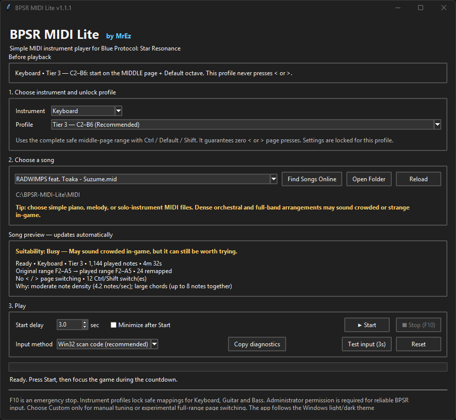

<h1 align="center">🎹 BPSR MIDI Lite</h1>

  A lightweight MIDI instrument player for <strong>Blue Protocol: Star Resonance</strong>.
   
  Supports <strong>Keyboard, Guitar, and Bass</strong>.
   
  Created by <strong>MrEz</strong>.

  

  
  
  

> [!IMPORTANT]
> Requires **Windows 10 or Windows 11, 64-bit**.  
> Accept the Administrator prompt when opening the app. Administrator permission is required for reliable BPSR input.

## Download

Download the standalone Windows application:

### [⬇ Download BPSR-MIDI-Lite.exe](https://github.com/Zudin987/BPSR-MIDI-Lite/releases/latest/download/BPSR-MIDI-Lite.exe)

No ZIP extraction, Python installation, setup wizard, or other dependency is required.

Windows may show a SmartScreen warning because the EXE is not code-signed. Make sure it was downloaded from this repository's official **Releases** page.

## What it does

BPSR MIDI Lite reads ordinary `.mid` and `.midi` files and converts the notes into keyboard input for BPSR's in-game instruments.

It is a single-purpose instrument tool. It does **not** automate combat, fishing, gathering, dungeons, or other gameplay.

## Highlights

- **Keyboard, Guitar, and Bass** support
- Simple unlock-based profiles for each instrument
- Fixed profiles never press the `<` or `>` page keys
- Automatic **Good fit / Busy / Very complex** song rating
- Automatic note folding and remapping for unavailable notes
- Custom profile for manual tuning and experimental full-range playback
- **Test input** button for checking keyboard injection
- **Copy diagnostics** button for easy troubleshooting
- **Find Songs Online** shortcut
- `F10` emergency stop
- Automatic Windows light/dark theme
- Standalone Windows EXE

## Quick start

1. Download and run `BPSR-MIDI-Lite.exe`.
2. Accept the Windows Administrator prompt.
3. Select **Keyboard**, **Guitar**, or **Bass**.
4. Select the profile matching your in-game unlock.
5. Click **Open Folder** and place your `.mid` or `.midi` files inside.
6. Click **Reload** and select a song.
7. Open the matching instrument in BPSR:
   - **Keyboard/Guitar:** middle page + Default octave
   - **Bass:** Default mode
8. Click **Start**, then focus the game during the countdown.
9. Press **F10** at any time to stop playback.

## Instrument profiles

| Instrument | Tier 1 | Tier 2 | Tier 3 | Custom |
|---|---|---|---|---|
| **Keyboard** | C3–B4 | C3–B6 | **C2–B6 — recommended** | Configurable; experimental A0–C8 |
| **Guitar** | C3–B4 | E2–B4 | **E2–D6** | Configurable experimental range |
| **Bass** | E1–B2 | **E1–B3** | — | Manual E1–B2 or E1–B3 |

### Profile behavior

- Fixed profiles stay on the middle page and never press `<` or `>`.
- Keyboard Tier 3 uses Ctrl, Default, and Shift.
- Guitar Tier 3 uses Low Octave, Default, and High Octave.
- Bass has no Low Octave mode.
- Bass Tier 2 enables Shift at playback start and resets it afterward.
- Custom is intended for manual tuning or experimental page switching.

## Song suitability

The app automatically checks the selected MIDI and displays one of these ratings:

- **Good fit:** should translate cleanly.
- **Busy:** may sound crowded, but can still be worth trying.
- **Very complex:** likely to sound messy in-game.

The rating considers note speed, chord size, remapped or removed notes, track count, percussion, and page-switch pressure.

For the best result, look for:

- Piano versions
- Melody-only arrangements
- Acoustic or solo-instrument versions
- Easy or simplified MIDIs

Avoid very dense orchestral, full-band, drum-heavy, medley, impossible-piano, or Black MIDI arrangements. The game's instrument has fewer usable notes than a full MIDI arrangement, so complicated songs may sound crowded or strange.

## Finding songs

Click **Find Songs Online** to open the Online Sequencer sequence browser.

Download a MIDI manually, place it inside the app's `MIDI` folder, then click **Reload**.

The app only opens the website in your browser. It does not scrape the website or download files automatically.

## Troubleshooting

### Nothing happens in BPSR

1. Confirm that you accepted the Administrator prompt.
2. Open Notepad and click **Test input (3s)**.
3. Make sure the game instrument window is open.
4. Confirm the correct instrument and unlock profile are selected.
5. Try another input method inside the app.

### The song sounds strange

- Check the suitability rating.
- Try a simpler piano or melody version.
- Try a lower fixed profile.
- In Custom, reduce the chord limit.
- Avoid full-band or orchestral arrangements.

### Reporting a problem

Click **Copy diagnostics**, then paste the report when opening a GitHub issue.

The report includes useful technical information such as:

- App and Windows version
- Instrument and profile
- Input method
- MIDI statistics
- Suitability result
- Last input-test result
- Last error

It does not include your full MIDI folder path.

## Notes

- Keep BPSR focused during playback.
- Press `F10` for an emergency stop.
- The suitability rating is guidance, not a guarantee; listening in-game is the final test.
- Guitar and Bass mappings are based on their in-game note layouts.
- Only use MIDI files you have permission to download and use.

## Credits

Created by **MrEz**.

Independent MIDI-only implementation inspired by `Sanheiii/ok-star-resonance`.

## Licence

Licensed under the **GNU Affero General Public License v3.0**. See [LICENSE](LICENSE).
